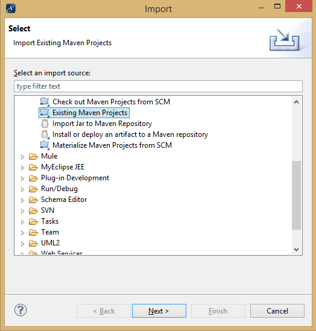
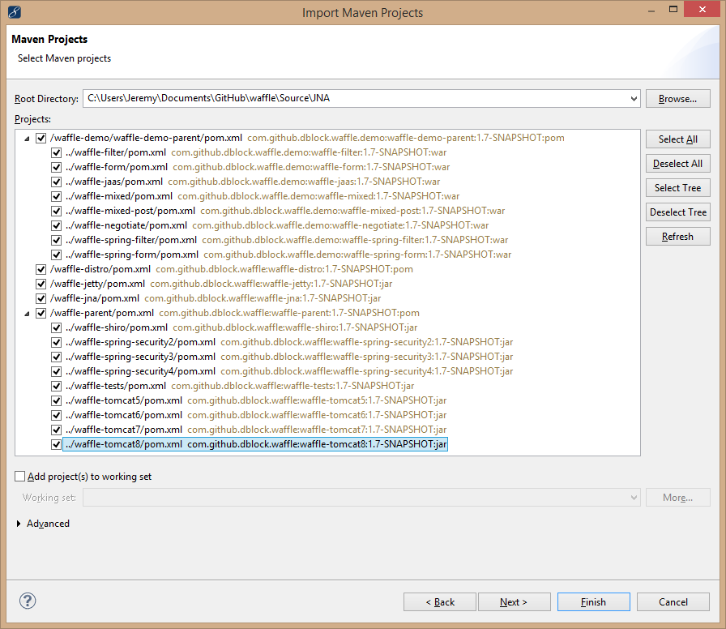
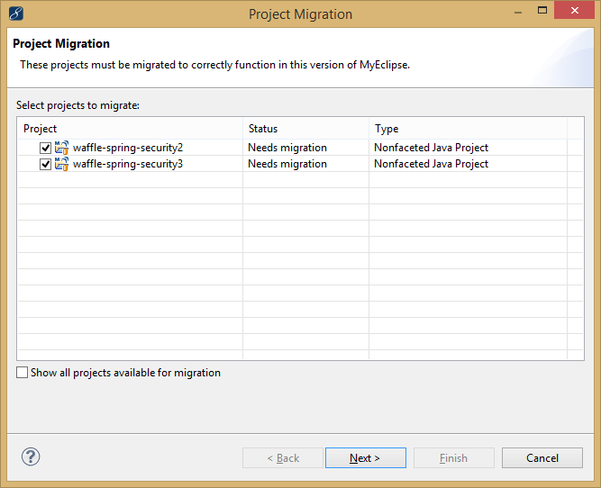
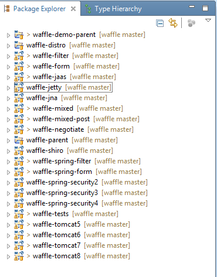
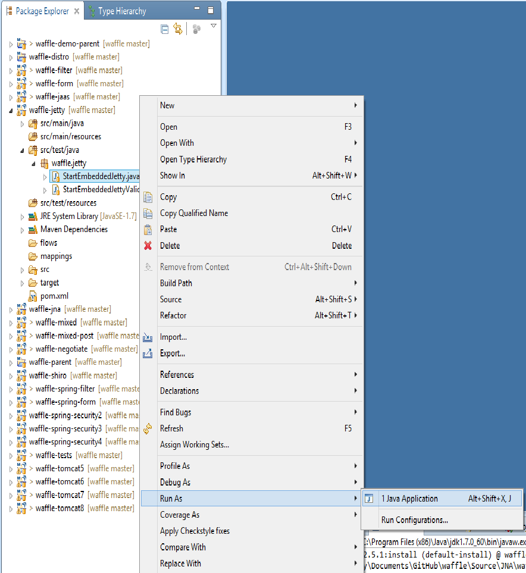

Setting Up a Development Environment
====================================

You're encouraged to contribute to WAFFLE. The latest information about this project and source code can be found on Github at [https://github.com/dblock/waffle](https://github.com/dblock/waffle)

Contributing
------------

Fork the project. Make pull requests. Bonus points for topic branches.

If you're not familiar with this workflow, please read [Using Pull Requests](https://help.github.com/articles/using-pull-requests). 

Development Environment
-----------------------

### Git

Download Git from [here](http://git-scm.com/downloads). During the installation, the wizard will offer to adjust your `PATH` environment. Select the second option "Run Git from the Windows Command Prompt".

### Java

Download and install the JDK from [here](http://www.oracle.com/technetwork/java/javase/downloads/index.html). Set `JAVA_HOME` to the location of the JDK in your computer's environment settings.

### Maven

Download Maven from [here](http://maven.apache.org/download.cgi) and unzip it to a directory of your choosing, eg. `c:\maven`. Add the `bin` directory to `PATH`, eg. `c:\maven\bin`. You should be able to type `mvn` on the command prompt.

### Third Party (Non Maven Central Items)

After maven is installed, go into `Source/ThirdParty` and run `maven-install.cmd`.  This will install third party dependencies needed for building that are not available in maven central.  This is done to allow us to avoid using system scope dependencies.

### Microsoft Visual Studio 2010

Visual Studio is not required, but useful when editing .NET code. At the least, install the Windows SDK for your operating system. You should be able to run `msbuild` from the command prompt after installing sdk.

### Windows SDK (Windows 7)

Windows 7 SDK can be found [here](http://www.microsoft.com/en-us/download/details.aspx?id=8279)

### Windows SDK (Windows 8.1)

Windows 8.1 SDK can be found [here](http://msdn.microsoft.com/en-us/windows/desktop/bg162891.aspx)

### NUnit

Download NUnit from [here](http://nunit.org).

### MSBuild Community Tasks

Download and install MSBuild Community Tasks from [here](https://github.com/loresoft/msbuildtasks/releases).

### Wix Toolset 3.9

Download and install the Wix toolset, specifically version 3.9 from [here](https://wix.codeplex.com/releases/view/136891).


Building the Project the First Time
-----------------------------------

If you are running on Windows Vista or later, you'll want to run the command prompt as Administrator. Type `build all`.

```
c:\source\Waffle\master> build all
```

This downloads thirdparty libraries using Maven, builds both Debug and Release .NET binaries, all Java code, runs tests and packages a release .zip in the `target` directory.

Using Visual Studio
-------------------

The C# implementation is in a Visual Studio solution file, `Waffle.sln`. 

Using Eclipse
-------------

Eclipse is not required, but useful when editing Java code.  Any other compariable IDE will work that has maven integration.

With Eclipse shown here, import the projects under `Source/JNA`. 




You may see need to migrate projects for the spring packages.  Try to do so, but if it fails, just cancel.  This is ok.  It will only work if spring is installed.



Projects will show as imported as follows.



To run the demos within the IDE, you can right click *StartEmbeddedJetty* > *Run As* (or *Debug As*) > *Java Appliction*. The server will start on localhost:8080.



To change which demo you are running, edit the code `waffle-jetty/src/test/java/StartEmbeddedJetty.java`:

```
String path = "../waffle-demo/waffle-filter";
```

Trobleshooting
--------------

### Git

```
'git' is not recognized as an internal or external command, operable program or batch file.
```

Git is missing.

### MSBuild Community Tasks

```
E:\Waffle.proj(2,11): error MSB4019: The imported project
"C:\Program Files\MSBuild\MSBuildCommunityTasks\MSBuild.Community.Tasks.Targets" was not found.
Confirm that the path in the <Import> declaration is correct, and that the file exists on disk.
```

MSBuild Community Tasks are missing.

### Wix

```
"E:\waffle\Waffle.proj" (all target) (1) ->
"E:\waffle\Waffle.sln" (Clean target) (2) ->
(Clean target) ->  E:\waffle\Source\WindowsAuthProviderMergeModule\WindowsAuthProviderMergeModule.wixproj(107,11):
error MSB4019: The imported project "C:\Program Files\MSBuild\Microsoft\WiX\v3.x\Wix.targets" was not found.
Confirm that the path in the <Import> declaration is correct, and that the file exists on disk.
```

Wix is missing.

### Product Version

A product version is generated via MSBuild and is applied to the rest of the project except java. The Java components built with `maven` and contain version information in the waffle-parent pom.

### Unit Tests Failed

The java components will only generate output files when all tests pass. They do when running on Windows 7 as Administrator. If you have a different system, you may skip tests with `mvn -DskipTests=true`. Output JARs will be placed in `Source\JNA\waffle-distro\target\waffle-distro`.

### Missing Dependencies in Eclipse 

Many thirdparty dependencies in Waffle are downloaded using Maven when you use `mvn clean install` or under manually located at `Source\ThirdParty\`.  For third party, see `Third Party (Non Maven Central Items)`.